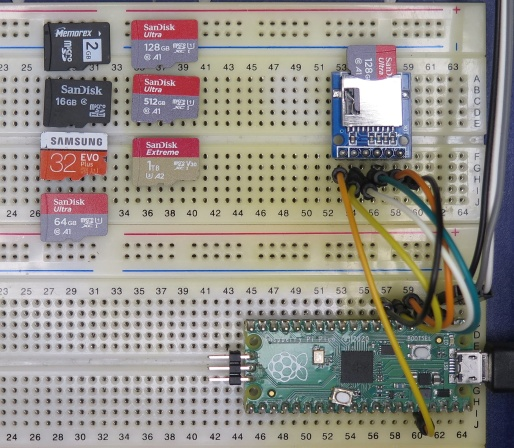
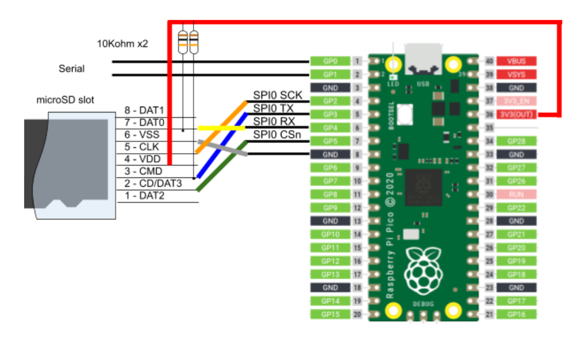

# FatFs library for Raspberry Pi Pico / Pico 2


[](https://github.com/elehobica/pico_fatfs/actions/workflows/build-binaries.yml)

## Overview
FatFs library on Raspberry Pi Pico / Pico 2.
This library supports:
* FatFs R0.15 ([http://elm-chan.org/fsw/ff/00index_e.html](http://elm-chan.org/fsw/ff/00index_e.html))
* SD card access by SPI interface
* SD, SDHC, SDXC cards
* FAT16, FAT32, exFAT formats
* test code for write / read speed benchmark

## Supported Board
* Raspberry Pi Pico and Raspberry Pi Pico W
* Raspberry Pi Pico 2 and Raspberry Pi Pico 2W

## Ciruit Diagram


## Pin Assignment
### microSD card

| Pico Pin # | Pin Name | Function | microSD connector | microSD SPI board |
----|----|----|----|----
|  4 | GP2 | SPI0_SCK | CLK (5) | CLK |
|  5 | GP3 | SPI0_TX | CMD (3) | MOSI |
|  6 | GP4 | SPI0_RX | DAT0 (7) | MISO |
|  7 | GP5 | SPI0_CSn | CD/DAT3 (2) | CS |
|  8 | GND | GND | VSS (6) | GND |
| 36 | 3V3(OUT) | 3.3V | VDD (4) | 3V3 |

#### Caution
* Wire length between Pico and SD card is very sensitive. Short wiring as possible is desired, otherwise errors such as Mount error, Preallocation error and Write fail will occur.

### Serial (CP2102 module)
| Pico Pin # | Pin Name | Function | CP2102 module |
----|----|----|----
|  1 | GP0 | UART0_TX | RXD |
|  2 | GP1 | UART0_RX | TXD |
|  3 | GND | GND | GND |

## How to build
* See ["Getting started with Raspberry Pi Pico"](https://datasheets.raspberrypi.org/pico/getting-started-with-pico.pdf)
* Put "pico-sdk", "pico-examples" and "pico-extras" on the same level with this project folder.
* Set environmental variables for PICO_SDK_PATH, PICO_EXTRAS_PATH and PICO_EXAMPLES_PATH
* Confirmed with Pico SDK 2.1.1
```
> git clone -b 2.1.1 https://github.com/raspberrypi/pico-sdk.git
> cd pico-sdk
> git submodule update -i
> cd ..
> git clone -b sdk-2.1.1 https://github.com/raspberrypi/pico-examples.git
>
> git clone -b sdk-2.1.1 https://github.com/raspberrypi/pico-extras.git
> 
> git clone -b main https://github.com/elehobica/pico_fatfs.git
```
### Windows
* Build is confirmed with Developer Command Prompt for VS 2022 and Visual Studio Code on Windows environment
* Confirmed with cmake-3.27.2-windows-x86_64 and gcc-arm-none-eabi-10.3-2021.10-win32
* Lanuch "Developer Command Prompt for VS 2022"
```
> cd pico_fatfs/test
> mkdir build && cd build
> cmake -G "NMake Makefiles" ..  ; (for Raspberry Pi Pico 1 series)
> cmake -G "NMake Makefiles" -DPICO_PLATFORM=rp2350 ..  ; (for Raspberry Pi Pico 2)
> nmake
```
* Put "pico_fatfs_test.uf2" on RPI-RP2 drive
### Linux
* Build is confirmed with [pico-sdk-dev-docker:sdk-2.1.1-1.0.0]( https://hub.docker.com/r/elehobica/pico-sdk-dev-docker)
* Confirmed with cmake-3.22.1 and arm-none-eabi-gcc (15:10.3-2021.07-4) 10.3.1
```
$ cd pico_fatfs/test
$ mkdir build && cd build
$ cmake ..  # (for Raspberry Pi Pico 1 series)
$ cmake -DPICO_PLATFORM=rp2350 ..  # (for Raspberry Pi Pico 2)
$ make -j4
```
* Download "pico_fatfs_test.uf2" on RPI-RP2 drive

## Configuration
Configure clock and pin settings by `pico_fatfs_set_config()` with `pico_fatfs_spi_config_t`

```
  pico_fatfs_spi_config_t config = {
      spi0,                   // spi_inst
      CLK_SLOW_DEFAULT,       // clk_slow
      CLK_FAST_DEFAULT,       // clk_fast
      PIN_SPI0_MISO_DEFAULT,  // pin_miso
      PIN_SPI0_CS_DEFAULT,    // pin_cs
      PIN_SPI0_SCK_DEFAULT,   // pin_sck
      PIN_SPI0_MOSI_DEFAULT,  // pin_mosi
      true                    // pullup
  };
  pico_fatfs_set_config(&config);
```

### Clock confguration
* By default, `clk_slow` is set to `100 * KHZ` and `clk_fast` is set to `50 * MHZ`.
* The actual SPI clock frequency is set to clk_peri / N = 125.0 MHz / N, which is determined by spi_set_baudrate() in ['pico-sdk/src/rp2_common/hardware_spi/spi.c'](https://github.com/raspberrypi/pico-sdk/blob/2062372d203b372849d573f252cf7c6dc2800c0a/src/rp2_common/hardware_spi/spi.c#L41).
* Thus, to choose actually slower clock as `clk_fast`, smaller value than 31.25 MHz should be configured.

### Pin assignment
* Choose `spi0` or `spi1` and designate corresponding pin assignment for `pin_miso`, `pin_cs`, `pin_sck` and `pin_mosi`.
* Pin selection must follow pin assignment rule defined by `spi0` or `spi1`. See comments PIN_SPIx_XXX_DEFAULT in [tf_card.h](tf_card.h).

### Pullup option
* set `true` for MISO, MOSI to use internal pullup. (recommended)
* set `false` for MISO, MOSI when external pullup resistors attached. [external pullup](doc/Pico_FatFs_Test_Schematic_w_pullup.png)

### Other customization for pin configuration
By default, `void pico_fatfs_init_spi()` in [tf_card.c](tf_card.c) runs for IO buffer initialization. User can override it by the re-definition to get more detail IO buffer configuration. However, the customizations such as slew rate and/or drive strength rarely improve the timing problem of SPI interface, therefore, physical approach such as shorter wiring would be recommended.

in C++ code (e.g. main.cpp)
```
extern "C" {
void pico_fatfs_init_spi(void)
{
  ...
}
}
```
or in C code (e.g. main.c)
```
void pico_fatfs_init_spi(void)
{
  ...
}
```

### Function customization
User can also override following functions as they are defined with _weak_ attribute.
* `DWORD get_fattime()` in [tf_card.c](tf_card.c)

## Benchmark Result (CLK_FAST = 50 MHz)
* Memorex microSD 2GB
```
=====================
== pico_fatfs_test ==
=====================
mount ok
Type is FAT16
Card size:    2.00 GB (GB = 1E9 bytes)

FILE_SIZE_MB = 5
BUF_SIZE = 512 bytes
Starting write test, please wait.

write speed and latency
speed,max,min,avg
KB/Sec,usec,usec,usec
79.8977, 215736, 2447, 6404
78.9926, 210883, 2460, 6457

Starting read test, please wait.

read speed and latency
speed,max,min,avg
KB/Sec,usec,usec,usec
827.0769, 2173, 500, 618
827.2137, 2171, 500, 618
```

* SanDisk microSDHC 16GB (C4)
```
=====================
== pico_fatfs_test ==
=====================
mount ok
Type is FAT32
Card size:   15.92 GB (GB = 1E9 bytes)

FILE_SIZE_MB = 5
BUF_SIZE = 512 bytes
Starting write test, please wait.

write speed and latency
speed,max,min,avg
KB/Sec,usec,usec,usec
247.8279, 31470, 1621, 2063
232.7164, 56411, 1596, 2197

Starting read test, please wait.

read speed and latency
speed,max,min,avg
KB/Sec,usec,usec,usec
792.8449, 3412, 621, 644
792.9706, 3411, 633, 644
```

* Sansung microSDHC EVO Plus 32GB (UHS-I U1)
```
=====================
== pico_fatfs_test ==
=====================
mount ok
Type is FAT32
Card size:   32.00 GB (GB = 1E9 bytes)

FILE_SIZE_MB = 5
BUF_SIZE = 512 bytes
Starting write test, please wait.

write speed and latency
speed,max,min,avg
KB/Sec,usec,usec,usec
447.7192, 6896, 1007, 1142
446.4797, 7589, 1024, 1145

Starting read test, please wait.

read speed and latency
speed,max,min,avg
KB/Sec,usec,usec,usec
974.9766, 1050, 403, 524
974.4066, 1049, 402, 524
```

* SanDisk microSDXC Ultra A1 64GB (UHS-I U1)
```
=====================
== pico_fatfs_test ==
=====================
mount ok
Type is EXFAT
Card size:   63.83 GB (GB = 1E9 bytes)

FILE_SIZE_MB = 5
BUF_SIZE = 512 bytes
Starting write test, please wait.

write speed and latency
speed,max,min,avg
KB/Sec,usec,usec,usec
457.3436, 39688, 890, 1118
459.7830, 19127, 896, 1112

Starting read test, please wait.

read speed and latency
speed,max,min,avg
KB/Sec,usec,usec,usec
1226.3135, 426, 398, 416
1226.0127, 425, 408, 416
```

* SanDisk microSDXC Ultra A1 128GB (UHS-I C10 U1)
```
=====================
== pico_fatfs_test ==
=====================
mount ok
Type is EXFAT
Card size:  127.83 GB (GB = 1E9 bytes)

FILE_SIZE_MB = 5
BUF_SIZE = 512 bytes
Starting write test, please wait.

write speed and latency
speed,max,min,avg
KB/Sec,usec,usec,usec
446.6393, 37701, 951, 1145
444.8114, 36075, 960, 1150

Starting read test, please wait.

read speed and latency
speed,max,min,avg
KB/Sec,usec,usec,usec
1310.1887, 416, 381, 389
1310.1887, 414, 381, 389
```

* SanDisk microSDXC Ultra A1 512GB (UHS-I U1)
```
=====================
== pico_fatfs_test ==
=====================
mount ok
Type is EXFAT
Card size:  511.80 GB (GB = 1E9 bytes)

FILE_SIZE_MB = 5
BUF_SIZE = 512 bytes
Starting write test, please wait.

write speed and latency
speed,max,min,avg
KB/Sec,usec,usec,usec
430.6728, 5316, 952, 1187
430.5244, 25833, 953, 1188

Starting read test, please wait.

read speed and latency
speed,max,min,avg
KB/Sec,usec,usec,usec
1304.3778, 408, 366, 391
1304.7181, 408, 378, 391
```

* SanDisk microSDXC Ultra A2 1TB (UHS-I U3 V30)
```
=====================
== pico_fatfs_test ==
=====================
mount ok
Type is EXFAT
Card size: 1023.74 GB (GB = 1E9 bytes)

FILE_SIZE_MB = 5
BUF_SIZE = 512 bytes
Starting write test, please wait.

write speed and latency
speed,max,min,avg
KB/Sec,usec,usec,usec
417.6842, 32387, 989, 1224
414.7391, 19074, 986, 1233

Starting read test, please wait.

read speed and latency
speed,max,min,avg
KB/Sec,usec,usec,usec
1288.9095, 412, 368, 396
1289.2418, 412, 381, 396
```

## Application Example
* [RPi_Pico_WAV_Player](https://github.com/elehobica/RPi_Pico_WAV_Player)
